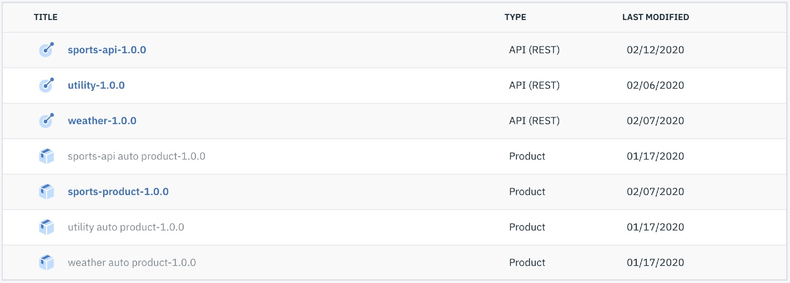
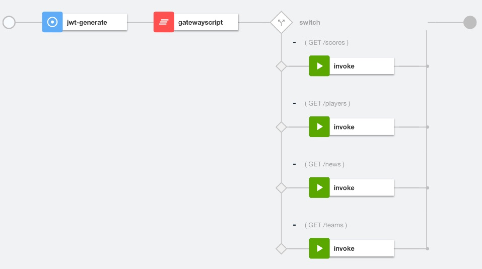
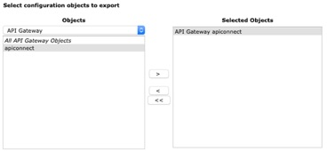

# Deploy Standalone DataPower API Gateway Service

**Pre-requisites**

* [Docker Desktop](https://www.docker.com/products/docker-desktop)
* [API Connect Local Test Environment (LTE)](https://www.ibm.com/support/knowledgecenter/SSMNED_2018/com.ibm.apic.toolkit.doc/rapic_lte_api_test.html)
* Clone the GitHub repository at [here](https://github.com/ozairs/apigateway.git) or [Download the respository zip file](https://github.com/ozairs/apigateway/archive/master.zip). 
* Following tools: [curl](https://curl.haxx.se) and [jq](https://stedolan.github.io/jq/)

## High-level Architecture and Process

The DataPower API Gateway service is a modern, highly performant, OpenAPI-driven API gateway runtime. It is a component within API Connect lifecycle management solution, which provides a comprehensive API platform that allows you to create, secure, manage and socialize APIs.

For use cases where you simply need to secure, rate-limit and control access to APIs (ie via API keys), it can simply be done using the API Gateway runtime. The process for creating the API Gateway configuration is done using the user interface for the API Gateway service, which is the API manager / API designer. When you publish APIs from the API designer, it converts API definitions into DataPower configuration. 

In general, you need to use the API manager when you need to continously publish APIs and create Application subscriptions (ie API Key). For scenarios, where you simply want to deploy a pre-defined set of APIs and Application subscriptions, you can export the configuration from the DataPower Gateway without the API Manager. Keep in mind that API subscriptions (ie client id) are not included within DataPower configuration because they are stored within a distributed cache. If you need to support real-time subscriptions, then its likely your using a developer portal and this approach would not satisfy this requirement. In this use case, the assumption is that API subscriptions are known and shared with API consumers out-of-band.

In this tutorial, you will perform the following:
1. Use the API Designer (via thee API Connect LTE) to create API definitions with API assemblies and publish them to the API Gateway.
2. Export DataPower configuration consisting of published API definitions.
3. Deploy a standalone DataPower configuration and unit-test the exported configuration from the previous step.
4. Create API Subscriptions with an API key to one or more API products packaged within the configuration.

Just to reinforce the use case, the assumption is that these API definitions are created at **design time** using the API designer, specifically using the API Connect Local Test Environment (LTE). Once the APIs are unit-tested within your development environment, you don't need the LTE, consider it as the **IDE** for your API Gateway enviornment.

## Step 1. Use the API Designer to create and publish API definitions.

In this section, use the API Connect LTE to create API definitions. The default subscription creates an API product for each API definition. Once your done testing, you should create an API product and reference the API definitions that you will use as part of your deployment.

For more details on using the API Connect LTE, several blogs are available here:
- [How to install Local Test Environment (LTE)](https://developer.ibm.com/apiconnect/2019/08/23/intall-local-test/)
- [Securing APIs using OAuth with Local Test Environment (LTE) and API Designer](https://developer.ibm.com/apiconnect/2019/09/04/securing-apis-using-oauth-with-lte-designer/)
- [Creating TLS Client Profile on Local Test Environment (LTE)](https://developer.ibm.com/apiconnect/2020/01/29/tls-client-profile-using-lte/)

1. Make sure you have downloaded the Git repository. The existing configuration in the `_deploy` folder contains a set of published API definitions. The APIs are visually shown in the screenshot below:
    

2. The `sports-api-1.0.0` API definition will be used extensively in the tutorials. The screenshot below shows the resources for the API definition:
    

3. The screenshot below defines the actions performed as part of the API Assembly:
    

You can skip to the next section if your planning to use the existing DataPower configuration in the `_deploy` folder; otherwise follow the instructions below to package your own configuration:

**Note**: These instructions assume you have already setup and deployed APIs using the API Connect LTE environment.

1. Use the DataPower instance from API Connect LTE environment. Login to the DataPower UI running at `https://127.0.0.1:9091/` with credentials `admin/admin`, and select the `apiconnect` domain. 
2. Export your DataPower configuration using the DataPower UI. In the home page, select **Export Configuration**.
3. Make sure that **Export configuration and files from the current domain** is selected and click **Next**.
4. Under **Objects**, select **API Gateway**, and the existing `apiconnect` object. Leave the remaining options at their default values and click the **>** button.

    
5. Click **Next** and follow the prompts to download and save the file to your workstation.


**Note**: Certificates are not included in the export package. You will need to manually copy these certificate files from your configuration or re-create them with the same name in your target environment. Since certificates should be unique across each environment, its a best practice to create the files again when deploying into your target environment.

## Step 2. Package for Deployment on Standalone DataPower

In this section, you will prepare the DataPower configuration for deployment into a standalone DataPower gateway for Docker.

1. Examine the structure of the folder. Note that you will need to manually include certificates **referenced** from your exported configuration since a DataPower export does not include certificate files.
    ```
    |-- _deploy
        |-- apigateway
            |-- certs
            |-- export
            |-- apic-gateway-service.xml
    |-- docker
    |-- istio
    |-- kubernetes
    |-- scripts
    ```
    The `apigateway` folder consists of the following:
    - The `export` folder contains the ZIP file for your exported DataPower configuration.
    - The `certs` folder contains the certificate files.
    - The `apic-gateway-service.xml` file contains configuration that can customize an existing API Gateway service deployment. You can add additional customizations into this file.

    The `scripts` folder contains scripts to run that will package & deploy the DataPower configuration and create/delete subscriptions.

2. You can use the existing API Gateway configuration from the `_deploy` directory or if you created your own configuration, then unzip your API Gateway configuration into the `_deploy/apigateway` directory. Manually change parameters within the <domain>.cfg files based on your target envioronment, such as the following:
    - Organization name
    - Catalog Name
    - Routing Prefix 
    - Fronside handler Local IP Address

3. Run a standalone DataPower Navigate which represents your target environment. It will be used to unit-test your configuration. Navigate to the `docker` directory and run the following command:
    ```
    docker run -dit \
    -v $PWD/config:/drouter/config \
    -v $PWD/local:/drouter/local \
    -v $PWD/temporary:/drouter/temporary \
    -e DATAPOWER_ACCEPT_LICENSE=true \
    -e DATAPOWER_INTERACTIVE=true \
    -e DATAPOWER_WORKER_THREADS=2 \
    -p 9090:9090 \
    -p 9022:22 \
    -p 5554:5554 \
    -p 9445:9443 \
    --name idg \
    ibmcom/datapower
    ```

4. Login to the DataPower UI (`https://127.0.0.1:9090`) using `admin/admin`. If your unable to access the UI, then you need to manually enable the Web gui and REST management interface with the following steps:
    ```
    docker attach idg (press enter)
    > login: admin
    > Password: admin

    idg(config)# co; web-mgmt
    Modify Web Management Service configuration
    idg(config web-mgmt)# admin-state enabled
    idg(config web-mgmt)# exit
    idg(config)# rest-mgmt       
    Modify REST Management Interface configuration
    idg(config rest-mgmt)# admin-state enabled
    idg(config rest-mgmt)# exit
    idg(config)# write mem
    Overwrite previously saved configuration? Yes/No [y/n]: y
    ```
    Close the terminal once done.

5. Login to the DataPower UI (`https://127.0.0.1:9090`) using `admin/admin`. If your unable to access the DataPower UI, make sure its running by checking `docker ps` or manually start it using `docker start idg`.

6. Create a new application domain (ADMINISTRATION -> Configuration -> Application Domain) called `apigateway`. The scripts assume this application domain name. Save the configuration.

7. Navigate to the `scripts` directory and use the script `import-apigateway.sh` to import the API Gateway Configuration and certificates (OAuth Secret Key, FSH key/cert).
    ```
    % ./import-apigateway.sh
    Using default config file at  /scripts/config.cfg
    .
    .
    .
    The script actions finished executing. Check logs to make sure that the configuration is imported (ie Configuration Import completed). When ready, click any key to continue. 
    
    ```

    Wait 30 seconds before pressing a key and continuing with the deployment.

    ```
    .
    .
    .
    >>>>>>>>>> Script actions completed. Check logs for more details. The configuration tasks will take a minute to complete. <<<<<<<<<< 
    ```

8. Run a sample request to validate that the API Gateway deployment is successful. The sample API does not require any API subscription. The `test-api.sh` script executes curl commands for the published APIs.
    ```
    % ./test-api.sh -f $PWD/config.cfg utility ping
    SUCCESS
    {"args":{},"headers":{"Accept":"application/json","Cache-Control":"no-transform","Content-Type":"application/json","Host":"httpbin.org","User-Agent":"curl/7.64.1","X-Amzn-Trace-Id":"Root=1-5e3e3aaa-b9fd8ecc381d77f422aeadd0","X-Client-Ip":"172.18.0.6","X-Global-Transaction-Id":"72c7cd995e3e3aaa00001741","X-Ratelimit-Limit":"name=default,100;","X-Ratelimit-Remaining":"name=default,99;"},"origin":"50.101.111.77","url":"https://httpbin.org/get"}
    ```

9. In the next step, use the following command to create an API subscriptions so you can invoke APIs protected with an API key.
    ```
    ./create-app-subscription.sh
    .
    .
    .
    >>>>>>>>>> Script actions completed. Check logs for more details. <<<<<<<<<< 
    ```

10. Review the `config.cfg` file, you will notice the client id and secret are pre-defined. The Sports API product is protected using OAuth security so you will first need to obtain an OAuth token and then call the Sports API. 
    ```
    CONSUMER_APP_ID=101
    CONSUMER_APP_NAME=sandbox-test-app
    CONSUMER_APP_CREDS=sports
    CONSUMER_CLIENT_ID=8c2fdb75e20d02b34be6d387d8c128f7
    CONSUMER_CLIENT_SECRET=0551696b64dcaafe2cfbc58de9134b09
    .
    .
    API_PRODUCT_PLAN_OBJ=localtest_sandbox_sports-product_1.0.0_premium-plan
    ```

11. Obtain an OAuth access token and then call the Sports API with that token. The `test-api.sh` script includes the API parameters needed to call the Sports API with OAuth security.
    ```
    ./test-api.sh -f $PWD/config.cfg oauth application
    
    >>>>>>>>>> OAuth API <<<<<<<<<< 

    Client Credentials: https://127.0.0.1.xip.io:9445/localtest/sandbox/oauth2/token

    SUCCESS
    {"token_type":"Bearer","access_token":"AAIgOGMyZmRiNzVlMjBkMDJiMzRiZTZkMzg3ZDhjMTI4ZjdsjchGgOOLEKSkmiAnVvWyqg4kITPPzk55xMp4POlXxn_3JWxFnieayjO4Sw0Phch8Pe7Q2vjZtD1x9me9G9FAETOepZ67mX_9AfG2UPDiCUe65LbIj27WGTNL6C6B_go","scope":"sports","expires_in":3600,"consented_on":1582223507}
    ```

12. Copy the OAuth access token and use it to call the Sports API
    ```
    ./test-api.sh -f $PWD/config.cfg sports-oauth teams

    >>>>>>>>>> Sports API https://127.0.0.1.xip.io:9445/localtest/sandbox/sports/teams?league=nba <<<<<<<<<< 

    Enter the access token: AAIgOGMyZmRiNzVlMjBkMDJiMzRiZTZkMzg3ZDhjMTI4ZjdsjchGgOOLEKSkmiAnVvWyqg4kITPPzk55xMp4POlXxn_3JWxFnieayjO4Sw0Phch8Pe7Q2vjZtD1x9me9G9FAETOepZ67mX_9AfG2UPDiCUe65LbIj27WGTNL6C6B_go

    SUCCESS
    ```
13. Stop and remove the DataPower docker instance once your finished testing.
    ```
    docker stop idg
    docker rm idg
    ```

    Congratulations, you have successfully deployed a standalone DataPower API Gateway service and tested APIs with no security, OAuth security and API subscriptions. The DataPower instance on Docker created three folders that will be used in subsequent tutorials (config, local, temporary)

## Summary

In this tutorial, You created API Gateway configuration using the API Connect LTE and packaged and deployed it using DataPower on Docker. In the next tutorial, you will use the existing volume mounts from the DataPower on Docker instance to run the container within a Kubernetes environment.
