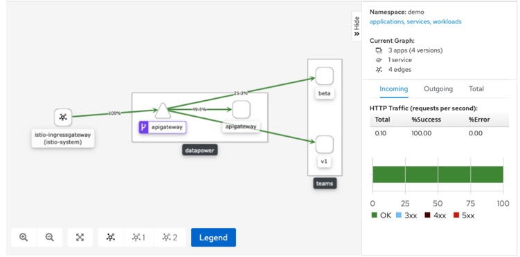
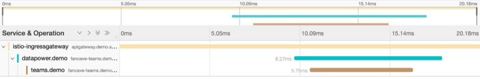

# Dynamically Route DataPower API Gateway Traffic using Istio Traffic Routing Rules

In this tutorial, you will learn how to apply Istio routing rules to dynamically control routing of microservices, either for business reasons or to provide new functionality via A/B testing. 

In this tutorial, you will apply Istio routing rules to perform dynamic routing for two use cases
  1. Dynamic routing based on the subscribed API Plan
  2. Perform A/B Testing of Multiple API Microservices (Standard vs Beta)

**Pre-requisites**
* [Docker Desktop](https://www.docker.com/products/docker-desktop)
* Clone the GitHub repository at [here](https://github.com/ozairs/datapower-container.git) or [Download the respository zip file](https://github.com/ozairs/datapower-container/archive/master.zip). 
* Following tools: [curl](https://curl.haxx.se), [jq](https://stedolan.github.io/jq/), either [repeat](https://www.google.com/search?q=zsh+repeat) or [watch](https://www.google.com/search?q=install+watch+command). 

1. In the previous tutorial, you deployed multiple instances of the fancave microservice.
    ```
    kubectl get deployments -n demo
    NAME                 READY   UP-TO-DATE   AVAILABLE   AGE
    apigateway           1/1     1            1           17h
    fancave-teams        1/1     1            1           16h
    fancave-teams-beta   1/1     1            1           16h
    ```
    Notice that there are two deployments, `fancave-teams` and `fancave-teams-beta`. These deployments represent two seperate microservices instances. When you have no routing rules, any of these microservices are invoked. When you configure routing rules, such as routing based on a label (`version: beta`) then Istio can always route to the microservice that contains the same label. In the following steps, you will observe how to influence the service mesh with routing rules based on HTTP header and Kubernetes labels.

2. Deploy a logging policy that will capture key metrics from the fancave-teams microservice. You can watch these logs to observe which microservice is invoked.
    ```
    kubectl apply -f log-entry.yaml
    ```

3. Run some sample requests again, and examine the log entries
    ```
    kubectl logs -f -n istio-system -l istio-mixer-type=telemetry -c mixer | grep "accesslog" | grep '"destination":"teams"'

    {"level":"warn","time":"2020-02-19T22:29:50.143637Z","instance":"accesslog.instance.istio-system","destination":"teams","destinationVersion":"beta","latency":"3.7895ms","responseCode":200,"responseSize":9195,"source":"istio-ingressgateway","user":"unknown"}
    ```

    The key fields from this message are `source`, `destination` and `destinationVersion`. In the next step, you will configure routing rules that identify the target microservice. The microservice will use the `destinationVersion` field and value `v1` for standard and `beta` for the beta servicee.

**Dynamic API Plan-based Routing**

4. Deploy the API plan-based policy that will perform routing to the microservice based on the subscribed API plan
    ```
    kubectl apply -f policies-plan.yaml
    ```

    The key parts of the policy are shown below, where a name is assigned `StableVersion` and `BetaVersion` based on the `version` labels.

    ```
    spec:
      host: fancave-teams.istio-demo.svc.cluster.local
      subsets:
      - name: StableVersion
        labels:
          version: v1
      - name: BetaVersion
        labels:
          version: beta
    ```

    The routing rules is defined based on the value of an HTTP header, specifically the value `beta-plan` routes to the `BetaVersion`, otherwise the request goes to the `StableVersion`.

    ```
    http:
    - match:
        - headers:
            plan:
            exact: beta-plan
        route:
        - destination:
            host: fancave-teams.istio-demo.svc.cluster.local
            subset: BetaVersion
    - route:
        - destination:
            host: fancave-teams.istio-demo.svc.cluster.local
            subset: StableVersion
    ```

5. Run some sample requests again, and examine the log entries. The last few requests should only show entries from the v1 service (ie `StableVersion`). Since the API subscription is using the `premium-plan`, the request is not going to the beta version.
    ```
    kubectl logs -f -n istio-system -l istio-mixer-type=telemetry -c mixer | grep "accesslog" | grep '"destination":"teams"'

    {"level":"warn","time":"2020-02-21T19:41:56.487327Z","instance":"accesslog.instance.istio-system","destination":"teams","destinationVersion":"v1","latency":"2.3712ms","responseCode":200,"responseSize":9195,"source":"datapower","user":"unknown"}
    {"level":"warn","time":"2020-02-21T19:41:56.486623Z","instance":"accesslog.instance.istio-system","destination":"teams","destinationVersion":"v1","latency":"3.3317ms","responseCode":200,"responseSize":9195,"source":"istio-ingressgateway","user":"unknown"}
    ```

6. Once your satisifed with the results, delete the routing rule, since we will use a different one in the next step.
    ```
    kubectl delete -f log-entry.yaml
    ```

**Dynamic API Plan-based Routing**

7. Deploy the A/B routing policy that will perform routing based on the configured distribution percentage
    ```
    kubectl apply -f policies-weight.yaml
    ```

    The StableVersion still gets 70% of the traffic but 30% of the traffic will now go to the `BetaVersion`.

8. Run some sample requests again using the `repeat` command, and examine the log entries. You should see a mix of requests for both the Stable and Beta versions.
    ```
    ./test-api.sh -f $PWD/config.cfg oauth application
    repeat 10 { ./test-api.sh -f $PWD/config.cfg sports-oauth teams <<< <access_token> }
    kubectl logs -f -n istio-system -l istio-mixer-type=telemetry -c mixer | grep "accesslog" | grep '"destination":"teams"'

    {"level":"warn","time":"2020-02-21T19:41:56.487327Z","instance":"accesslog.instance.istio-system","destination":"teams","destinationVersion":"v1","latency":"2.3712ms","responseCode":200,"responseSize":9195,"source":"datapower","user":"unknown"}
    {"level":"warn","time":"2020-02-21T19:41:56.486623Z","instance":"accesslog.instance.istio-system","destination":"teams","destinationVersion":"v1","latency":"3.3317ms","responseCode":200,"responseSize":9195,"source":"istio-ingressgateway","user":"unknown"}
    ```

Its still unclear if we are getting the 70/30 split from the logs. Istio released a new tool called Kiali that provides visualization of pods deployed within the Istio mesh, including visibility on traffic distribution. In the next step, you will use Kiali to visualize the traffic distribiution.

9. Following the instructions for installing the Kiali dashboard [here](https://istio.io/docs/tasks/observability/kiali/).

10. Login to the Kiali dashboard, it provides visualization of the current deployment. Open a new terminal and run the following command:
    ```
    istioctl dashboard kiali &
    ```

11. Login with the username and password that you configured as part of the setup process.

12. Click the Graph link and select the namespace `demo`. Run some traffic so that Kiali can display visualization. After a few seconds, the page will refresh. 
    

13. You can select various filters to view the traffic. Seleect the **Requests percentage** to display percentage requests on each path.

14. Run some sample requests again using the `repeat` command, and examine the Graph. You should see a mix of requests for both the Stable and Beta versions. 
    ```
    ./test-api.sh -f $PWD/config.cfg oauth application
    repeat 10 { ./test-api.sh -f $PWD/config.cfg sports-oauth teams <<< <access_token> }
    ```

**Tracing**

15. You can use the Jaeger plugin to understand the latency across each microservice within the Istio service mesh.  Run the Jaeger dashboard with the following command:
    ```
    istioctl dashboard jaeger &
    ```

16. In the Service drop-down, select `teams.demo` and select **Find Traces**. Select any trace to view the spans (individual microservice information).
    


17. Kill all the background processes with the command `pkill istioctl`

Congratulations, you have successfully deployed Istio routing rules to control traffic routing from the API Gateway to the fancave-teams microservices, either v1 (Stable) or beta (Beta) versions.


## Summary

In this tutorial, you configured an Istio JWT Security policy to protect access to a microservice with a valid JWT Token. The DataPower API Gateway service is then used to generate a token and invoke the Fancave Teams microservice successfully. 

## Cleanup

 If you want to delete your Istio cluster, use the command: `istioctl manifest generate --set profile=demo | kubectl delete -f -`